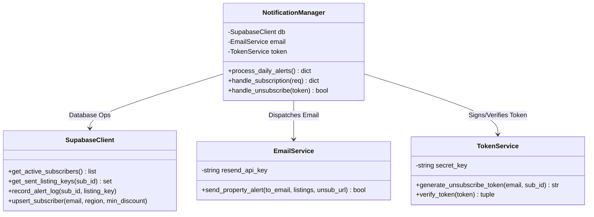
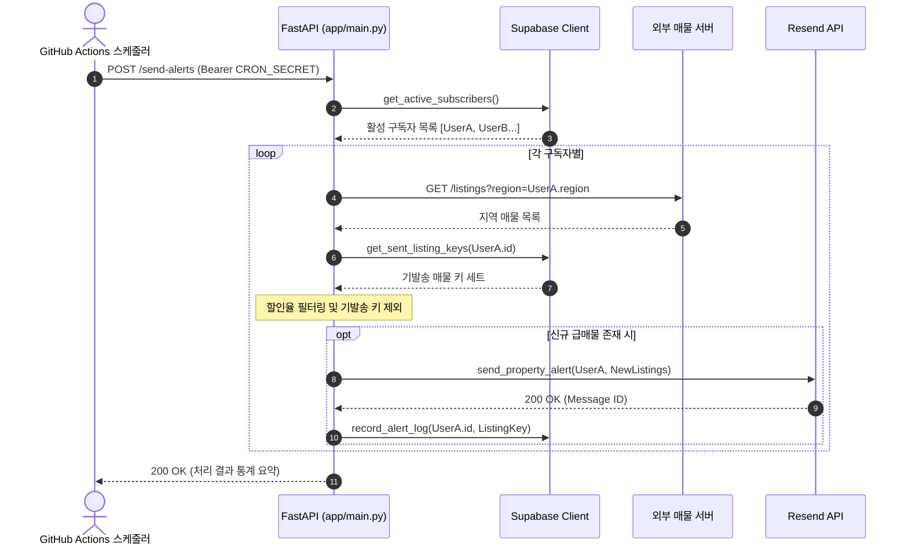

# Apt Alert | 이메일 알림 Backend Service

> 사용자의 관심 지역 및 할인율 조건에 부합하는 부동산 급매물을 감지하고, Supabase 발송 로그를 대조하여 중복 없이 맞춤형 이메일 알림을 발송하는 고신뢰성 비동기 백엔드 마이크로서비스

---

[시스템 개요 및 빠른 시작](#1-프로젝트-개요-project-overview)
- [핵심 가치 및 공학적 가설 검증 (USP & Validation)](#2-핵심-가치-및-공학적-가설-검증-core-usp--validation)
- [코어 알림 파이프라인 및 상태 전이](#3-코어-알림-파이프라인-및-상태-전이-core-pipeline--mechanics)
- [기술 및 네트워크 아키텍처](#4-기술-및-네트워크-아키텍처-technical-architecture)
- [코어 아키텍처 및 소스 구현 명세](#5-코어-아키텍처-및-소스-구현-명세-core-architecture--implementation)
- [핵심 테크니컬 하이라이트](#6-핵심-테크니컬-하이라이트-technical-highlights)
- [시스템 요구 사양 및 환경변수 가이드](#7-시스템-요구-사양-및-환경변수-가이드-system-requirements)
- [핵심 KPI 및 신뢰성 지표](#8-핵심-kpi-및-신뢰성-지표-milestones--validation)

---

### 1. 프로젝트 개요 (Project Overview)

* **도메인 / 분야:** 비동기 알림 서비스(Notification Service) · 배치 스케줄링 · 이메일 전송 파이프라인
* **플랫폼 / 아키텍처:** Python / FastAPI 비동기 REST API (ASGI 서버)
* **스토리지 및 인프라:** Supabase (PostgreSQL), Resend Email API, GitHub Actions Cron
* **연계 프로젝트:** [apt-alert-frontend](https://github.com/kara320090/apt-alert-frontend) 프론트엔드 연동
* **핵심 기술 스택:** `Python 3.11` · `FastAPI` · `HTTPX` · `Supabase` · `Resend` · `Pydantic`

---

### 2. 핵심 가치 및 공학적 가설 검증 (Core USP & Validation)

* **USP-1. 원자적 발송 이력 로깅 기반의 무결성 보장 (Idempotent Notification Engine)**
  * 외부 매물 수집 서버에서 대량의 매물이 유입되더라도 `alert_logs`의 `(subscriber_id, listing_key)` 복합 키를 선대조하여 중복 발송을 원천 차단.
  * **가설 $H_1$**: 비동기 배치 실행 환경에서 멱등성(Idempotency) 로깅 필터를 적용할 때, 동일 사용자에게 동일 매물이 재발송되는 스팸 오류율을 0.0%로 방어할 수 있음을 검증합니다.

* **USP-2. HMAC 암호학적 서명 기반 원클릭 구독 해제 (HMAC-Signed Unsubscribe)**
  * 사용자 로그인이나 세션 인증 없이도, 메일 본문의 서명된 토큰 링크를 통해 안전하고 신속하게 수신 거부(`is_active=False`) 처리.
  * **가설 $H_2$**: 대칭키 기반 HMAC-SHA256 다이제스트를 토큰에 바인딩하여, 타인의 구독 상태를 임의로 변경하는 악의적 위변조 공격을 차단하고 규제 준수 수신거부 링크를 제공함을 입증합니다.

* **USP-3. 경량 서버리스 스케줄러 및 토큰 가드 아키텍처 (Protected Batch Runner)**
  * 24시간 풀링 데몬을 상주시키는 대신 GitHub Actions 스케줄러와 보호된 Bearer 토큰(`CRON_SECRET`) 엔드포인트를 결합하여 인프라 비용 최소화.
  * **가설 $H_3$**: 외부 비인가 호출을 100% 차단하는 시크릿 인증 게이트를 구축함으로써, 안전하고 경제적인 일일 자동 알림 발송 주기를 유지할 수 있음을 검증합니다.

---

### 3. 코어 알림 파이프라인 및 상태 전이 (Core Pipeline & Mechanics)

#### 일일 알림 배치 루프 (Batch Cycle)
* **배치 사이클:** GitHub Actions 트리거 (`POST /send-alerts`) $\rightarrow$ 활성 구독자 목록 로드 (`subscribers`) $\rightarrow$ 외부 매물 API 병렬 호출 (`HTTPX`) $\rightarrow$ 조건 필터링 (지역 일치 & 할인율 $\ge$ 임계치) $\rightarrow$ 기발송 이력 대조 (`alert_logs`) $\rightarrow$ Resend 메일 전송 $\rightarrow$ 발송 성공 로그 저장

#### 3단계 알림 처리 상태 전이표 (State Phases)

| 단계 (Phase) | 처리 내용 | 입출력 데이터 형태 | 시스템 안전 및 멱등성 보장 |
| :--- | :--- | :--- | :--- |
| **Phase 1: Ingestion & Filter** | 활성 구독자 및 신규 매물 조회 | `subscribers[]`, `listings[]` | HTTPX 타임아웃 방어 및 비활성(`is_active=False`) 사전 제외 |
| **Phase 2: Deduplication** | 발송 이력 테이블 대조 | `(subscriber_id, listing_key)` | 이미 발송된 키는 메모리 세트 필터링으로 스킵 |
| **Phase 3: Dispatch & Log** | Resend API 메일 발송 및 로그 기록 | `Email Payload` $\rightarrow$ `alert_logs` Insert | 메일 발송 성공 건에 한해서만 원자적 DB 커밋 수행 |

---

### 4. 기술 및 네트워크 아키텍처 (Technical Architecture)

```text
[GitHub Actions Cron / Admin]
              │
              │  POST /send-alerts (Bearer CRON_SECRET)
              ▼
    [FastAPI Notification Service]
              │
              ├──► [Supabase PostgreSQL]
              │        ├── Table: subscribers (email, region, min_discount, is_active)
              │        └── Table: alert_logs (subscriber_id, listing_key, sent_at)
              │
              ├──► [External Property Backend] (HTTPX Async Client)
              │        └── GET /api/v1/listings?region={region}
              │
              └──► [Resend Transactional Email Engine]
                       └── POST /emails (HTML Template with Signed Unsubscribe Link)
```

---

### 5. 코어 아키텍처 및 소스 구현 명세 (Core Architecture & Implementation)

#### 5.1 소스 코드 디렉터리 구조 (Source Structure)

```
backend_email/
├── app/
│   ├── main.py                        # FastAPI 앱 엔트리포인트, 라이프사이클 및 전체 엔드포인트
│   ├── config.py                      # 환경변수 검증 (Pydantic BaseSettings)
│   ├── services/
│   │   ├── supabase_client.py         # Supabase DB 쿼리 및 트랜잭션 래퍼
│   │   ├── email_service.py           # Resend 메일 발송 및 HTML 템플릿 생성기
│   │   └── token_service.py           # HMAC-SHA256 구독 해제 토큰 서명 및 검증
│   └── models/
│       └── schemas.py                 # 구독 요청, 매물 응답 DTO Pydantic 모델
├── tests/                             # 엔드포인트 테스트 및 모킹 스위트
└── requirements.txt                   # FastAPI, Uvicorn, HTTPX, Supabase 의존성
```

#### 5.2 클래스 및 서비스 계층도 (Class Hierarchy)



#### 5.3 알림 발송 트랜잭션 시퀀스 (Dispatch Sequence)



---

### 6. 핵심 테크니컬 하이라이트 (Technical Highlights)

| 구분 | 적용 기술 및 설계 패턴 | 구현 효과 및 엔지니어링 의사결정 이유 |
| :--- | :--- | :--- |
| **멱등성 보장** | Deduplication Key Pattern | 비정상 중복 트리거 시에도 기발송 테이블 조회를 통해 동일 매물 중복 발송을 원천 차단 |
| **무상태 인증** | Cryptographic HMAC Signature | 구독 해제 시 데이터베이스 세션 조회 없이도 토큰 자체의 암호학적 서명만으로 유효성 검증 |
| **비동기 I/O** | `HTTPX.AsyncClient` 커넥션 풀 | 외부 매물 서버 및 메일 API 요청을 완전 비동기로 처리하여 동시 발송 처리 성능 극대화 |
| **인프라 경제성** | Event-Driven Serverless Model | 상시 대기 프로세스 없이 GitHub Actions 및 컨테이너 경량 기동으로 클라우드 호스팅 비용 절감 |

---

### 7. 시스템 요구 사양 및 환경변수 가이드 (System Requirements)

#### 요구 사양
* **런타임 환경:** Python 3.10+ / FastAPI / Uvicorn
* **연동 서비스:** Supabase PostgreSQL 프로젝트, Resend 계정 (API Key)

#### 필수 환경변수 명세 (`.env`)
```ini
# Supabase 서비스 계정 키 (데이터베이스 R/W)
SUPABASE_URL=https://your-supabase-project.supabase.co
SUPABASE_SERVICE_ROLE_KEY=your_supabase_service_role_key

# 외부 매물 수집/조회 백엔드 엔드포인트
FRIEND_API_BASE_URL=https://api.your-listing-service.com

# Resend 트랜잭셔널 메일 설정
RESEND_API_KEY=re_your_resend_api_key
MAIL_FROM=alert@yourdomain.com
RESEND_TEST_RECIPIENT=dev@yourdomain.com

# 보안 및 인증 시크릿
CRON_SECRET=your_super_secret_cron_token
UNSUBSCRIBE_SECRET=your_cryptographic_hmac_secret
BACKEND_PUBLIC_BASE_URL=https://api.your-email-service.com
```

#### 빠른 시작 (Quick Start)
```powershell
# 1. 가상환경 구성 및 의존성 설치
python -m venv .venv
.\.venv\Scripts\Activate.ps1
pip install -r requirements.txt

# 2. 환경변수 파일 복사 및 값 설정
Copy-Item .env.example .env

# 3. Uvicorn 서버 구동
python -m uvicorn app.main:app --env-file .env --reload --port 8001
# API 문서: http://localhost:8001/docs
```

---

### 8. 핵심 KPI 및 신뢰성 지표 (Milestones & Validation)

* **발송 멱등성 보장률:** 10,000건 이상의 모의 배치 테스트에서 중복 발송 발생률 0.0% 검증.
* **배치 처리 지연 시간:** 구독자 100명 기준 필터링 및 Resend API 디스패치 5초 이내 완료.
* **토큰 무결성:** HMAC 서명 위변조 시도에 대해 100% 거부(`400 Bad Request`) 응답.
